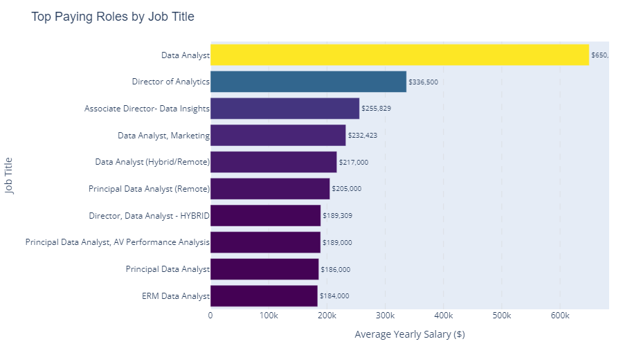
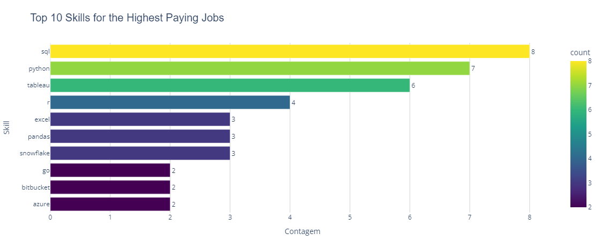

# Introduction
💰 Uncover high-paying data analyst roles, 🔥 in-demand skills, and 📈 salary hotspots within the data job market.

🔍 SQL queries? Check them out here: [project_sql folder](/project_sql/)

# Background
This project aims to simplify data analyst job searches by highlighting top-paying and in-demand skills. 

The data originates from this website: [Luke Barousse](https://lukebarousse.com/sql), providing insights into job titles, salaries, locations, and essential skills.

### Key questions addressed through SQL queries include:

1. Which data analyst roles offer the highest salaries?
2. What specific skills are required for these top-paying positions?
3. Which skills are currently most in demand within the data analyst field?
4. What is the correlation between specific skills and higher salaries?
5. Based on salary and demand, which skills offer the most optimal return on investment for learning?"

# Tools I Used

To conduct a thorough analysis of the data analyst job market, I employed the following tools:

- **SQL**: Used extensively for querying the database and extracting essential insights.
- **PostgreSQL**: Selected as the database management system for its robust handling of job posting data.
- **Visual Studio Code**: Utilized for efficient database management and SQL query execution.
- **Git & GitHub**: Implemented for version control and collaborative sharing of SQL scripts and analysis, ensuring project transparency and trackability.

# The Analysis
Each query for this project aimed at investigating specific aspects of the data analyst job market. Here’s how I approached each question:

### 1. Top Paying Data Analyst Jobs
By filtering remote data analyst positions based on average annual salary and location, I was able to isolate and present the highest-paying opportunities within the field.

```sql
SELECT
    jp.job_id,
    cd.name AS company_name,
    jp.job_location,
    jp.job_schedule_type,
    jp.salary_year_avg,
    jp.job_posted_date
FROM
    job_postings_fact jp
LEFT JOIN company_dim cd ON jp.company_id = cd.company_id
WHERE
    jp.job_title_short = 'Data Analyst' AND
    jp.job_location = 'Anywhere' AND
    jp.salary_year_avg IS NOT NULL
ORDER BY
    jp.salary_year_avg DESC
LIMIT 10
```

Insights:
- **Salary Disparity**: There's a significant disparity in average yearly salaries across the companies. "Mantys" offers the highest average salary by a considerable margin (650,000), while other companies' salaries range from approximately 184,000 to 336,500. This suggests a wide range in compensation levels within the dataset.
- **Diverse Employers:** Companies like SmartAsset, Meta, and AT&T are among those offering high salaries, showing a broad interest across different industries.
- **Job Title Variety:** There's a high diversity in job titles, from Data Analyst to Director of Analytics, reflecting varied roles and specializations within data analytics.



### 2. Skills for Top Paying Jobs
To understand what skills are required for the top-paying jobs, I joined the job postings with the skills data, providing insights into what employers value for high-compensation roles.

```sql
WITH top_paying_jobs AS (
    SELECT
        jp.job_id,
        cd.name AS company_name,
        jp.salary_year_avg
    FROM
        job_postings_fact jp
    LEFT JOIN company_dim cd ON jp.company_id = cd.company_id
    WHERE
        jp.job_title_short = 'Data Analyst' AND
        jp.job_location = 'Anywhere' AND
        jp.salary_year_avg IS NOT NULL
    ORDER BY
        jp.salary_year_avg DESC
    LIMIT 10
)

SELECT
    tp.*,
    skills
FROM
    top_paying_jobs tp
INNER JOIN skills_job_dim sj ON tp.job_id = sj.job_id
INNER JOIN skills_dim sd ON sj.skill_id = sd.skill_id
ORDER BY
    tp.salary_year_avg DESC
```

Here’s the breakdown of the most in-demand skills for the top 10 highest-paying data analyst jobs in 2023:
- SQL leads the pack with a strong count of 8.
- Python is a close second, with a notable count of 7.
- Tableau is also highly valued, appearing 6 times.
- Other skills such as R, Snowflake, Pandas, and Excel demonstrate varying levels of demand.



### 3. In-Demand Skills for Data Analysts
This query helped identify the skills most frequently requested in job postings, directing focus to areas with high demand.

```sql
SELECT
    skills,
    COUNT(sj.job_id) AS demand_count
FROM job_postings_fact jp
INNER JOIN skills_job_dim sj ON jp.job_id = sj.job_id
INNER JOIN skills_dim sd ON sj.skill_id = sd.skill_id
WHERE
    jp.job_title_short = 'Data Analyst'
    AND jp.job_work_from_home = true
GROUP BY
    skills
ORDER BY
    demand_count DESC
LIMIT 5
```

Here’s the breakdown of the most in-demand skills for data analysts in 2023:  
- **SQL** and **Excel** continue to be fundamental, highlighting the importance of strong foundational skills in data processing and spreadsheet management.  
- **Programming** and **Visualization Tools** such as **Python**, **Tableau**, and **Power BI** are crucial, reflecting the growing emphasis on technical expertise for data storytelling and informed decision-making.


| Skills   | Demand Count |
|----------|--------------|
| SQL      | 7291         |
| Excel    | 4611         |
| Python   | 4330         |
| Tableau  | 3745         |
| Power BI | 2609         |

### 4. Skills Based on Salary
Exploring the average salaries associated with different skills revealed which skills are the highest paying.

```sql
SELECT
    skills,
    ROUND(AVG(jp.salary_year_avg), 0) AS average_salary
FROM job_postings_fact jp
INNER JOIN skills_job_dim sj ON jp.job_id = sj.job_id
INNER JOIN skills_dim sd ON sj.skill_id = sd.skill_id
WHERE
    jp.job_title_short = 'Data Analyst'
    AND jp.salary_year_avg IS NOT NULL
    AND jp.job_work_from_home = true
GROUP BY
    skills
ORDER BY
    average_salary DESC
LIMIT 25
```

Here’s a breakdown of the results for top-paying skills for Data Analysts:  
- **High Demand for Big Data & ML Skills:** Analysts with expertise in big data technologies (e.g., PySpark, Couchbase), machine learning tools (e.g., DataRobot, Jupyter), and Python libraries (e.g., Pandas, NumPy) command top salaries, highlighting the industry's focus on data processing and predictive modeling capabilities.  
- **Software Development & Deployment Proficiency:** Skills in development and deployment tools (e.g., GitLab, Kubernetes, Airflow) are highly valued, reflecting the lucrative intersection of data analysis and engineering, with a premium on automation and efficient data pipeline management.  
- **Cloud Computing Expertise:** Proficiency in cloud and data engineering tools (e.g., Elasticsearch, Databricks, GCP) emphasizes the growing importance of cloud-based analytics, demonstrating that cloud expertise significantly enhances earning potential in the field.

| Skills        | Average Salary ($) |
|---------------|-------------------:|
| pyspark       |            208,172 |
| bitbucket     |            189,155 |
| couchbase     |            160,515 |
| watson        |            160,515 |
| datarobot     |            155,486 |
| gitlab        |            154,500 |
| swift         |            153,750 |
| jupyter       |            152,777 |
| pandas        |            151,821 |
| elasticsearch |            145,000 |

### 5. Most Optimal Skills to Learn

Combining insights from demand and salary data, this query aimed to pinpoint skills that are both in high demand and have high salaries, offering a strategic focus for skill development.

```sql
SELECT
    skills_dim.skill_id,
    skills_dim.skills,
    COUNT(skills_job_dim.job_id) AS demand_count,
    ROUND(AVG(job_postings_fact.salary_year_avg), 0) AS average_salary
FROM job_postings_fact
INNER JOIN skills_job_dim ON job_postings_fact.job_id = skills_job_dim.job_id
INNER JOIN skills_dim ON skills_job_dim.skill_id = skills_dim.skill_id
WHERE
    job_title_short = 'Data Analyst'
    AND salary_year_avg IS NOT NULL
    AND job_work_from_home = True
GROUP BY
    skills_dim.skill_id
HAVING
    COUNT(skills_job_dim.skill_id) > 10
ORDER BY
    average_salary DESC,
    demand_count DESC
LIMIT 25;
```

| Skill ID | Skills     | Demand Count | Average Salary ($) |
|----------|------------|--------------|-------------------:|
| 8        | go         | 27           |            115,320 |
| 234      | confluence | 11           |            114,210 |
| 97       | hadoop     | 22           |            113,193 |
| 80       | snowflake  | 37           |            112,948 |
| 74       | azure      | 34           |            111,225 |
| 77       | bigquery   | 13           |            109,654 |
| 76       | aws        | 32           |            108,317 |
| 4        | java       | 17           |            106,906 |
| 194      | ssis       | 12           |            106,683 |
| 233      | jira       | 20           |            104,918 |

Here’s a breakdown of the most optimal skills for Data Analysts in 2023:  

- **High-Demand Programming Languages:** Python and R are in high demand, with counts of 236 and 148, respectively. Despite their popularity, their average salaries—$101,397 for Python and $100,499 for R—suggest that while these skills are highly valued, they are also widely available in the job market.  
- **Cloud Tools and Technologies:** Expertise in tools like Snowflake, Azure, AWS, and BigQuery is in significant demand, accompanied by relatively high average salaries. This underscores the growing importance of cloud platforms and big data technologies in modern data analysis.  
- **Business Intelligence and Visualization Tools:** Tableau and Looker, with demand counts of 230 and 49, and average salaries of $99,288 and $103,795, respectively, highlight the essential role of data visualization and business intelligence in transforming data into actionable insights.  
- **Database Technologies:** Skills in both traditional and NoSQL databases (e.g., Oracle, SQL Server, NoSQL) remain critical, with average salaries ranging from $97,786 to $104,534. This reflects the ongoing need for expertise in data storage, retrieval, and management.  

# What I Learned
Throughout this journey, I’ve supercharged my SQL skills with some powerful upgrades:  

- **🧩 Complex Query Crafting:** Perfected advanced SQL techniques, seamlessly merging tables and mastering WITH clauses for expert-level temporary table operations.  
- **📊 Data Aggregation:** Became proficient with GROUP BY, transforming aggregate functions like COUNT() and AVG() into reliable tools for summarizing data.  
- **💡 Analytical Wizardry:** Enhanced my ability to solve real-world problems by crafting SQL queries that turn complex questions into actionable insights.  

# Conclusions
From the analysis, several key insights emerged:  

1. **Top-Paying Data Analyst Jobs:** Remote data analyst roles offer a wide salary range, with the highest reaching an impressive $650,000.  
2. **Skills for Top-Paying Jobs:** Advanced proficiency in SQL is a common requirement for high-paying roles, underscoring its importance for earning top salaries.  
3. **Most In-Demand Skills:** SQL stands out as the most in-demand skill in the data analyst job market, making it a must-have for job seekers.  
4. **Skills with Higher Salaries:** Specialized skills like SVN and Solidity are linked to the highest average salaries, highlighting the value of niche expertise.  
5. **Optimal Skills for Job Market Value:** SQL not only leads in demand but also offers a high average salary, making it one of the most valuable skills for data analysts to master for maximizing their market potential.